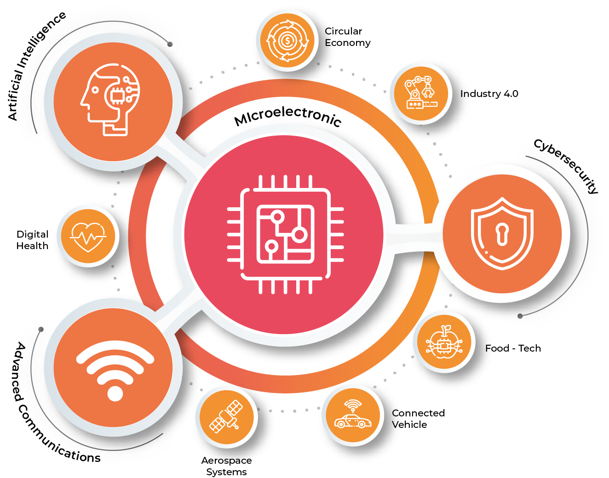

# 🚀 INNOVA IRV Institute of Innovation

## 🌟 About Us

INNOVA IRV, Ricardo Valle Institute of Innovation Foundation, is a center for technological innovation applied to industry that promotes, develops, and fosters knowledge transfer activities to generate value in the market. Our mission is to catalyze industrial progress through collaborative research, cross-disciplinary approaches, and the practical application of pioneering ideas.

## 🔬 Our Focus

Our primary areas of innovation include:

1. **Microelectronics** 🔧: Leading advancements in microelectronics to power next-generation industrial solutions.

2. **Artificial Intelligence** 🤖: Leveraging AI to develop intelligent systems that address complex industrial challenges.

3. **Cybersecurity** 🔒: Developing robust security solutions to protect digital infrastructures.

4. **Advanced Communications** 📡: Creating cutting-edge communication technologies for seamless, high-speed connectivity.

  

These core areas support applications across sectors such as:

- **Food Tech** 🍲: Innovating in food technology to enhance sustainability and production.

- **Circular Economy** 🔄: Promoting sustainable practices and resource efficiency.

- **Aerospace** 🚀: Developing solutions to support the growing demands of the aerospace industry.

## 🎯 Our Objectives

Our objectives reflect our commitment to advancing industry and society:

- **Supporting Reindustrialization**: Facilitating growth and strengthening companies within the industry.

- **Boosting the Economy**: Establishing INNOVA IRV as a hub of valuable innovation and a driving force for the Spanish economy.

- **Creating High Value-Added Jobs**: Contributing to the creation of high-value employment and maximizing the impact of R&D&I capacity.

- **Valuing Knowledge**: Transforming knowledge into high-value products for the market.

## 🤝 Get Involved

We welcome collaboration with researchers, institutions, and industry partners. To learn more about our current projects or partnership opportunities, please visit our website or [contact](https://innovairv.com/en/contact/) us directly.

Email: [info@innovairv.com](mailto:info@innovairv.com)

---

© 2024 INNOVA IRV Institute of Innovation. All rights reserved.

<!--

**Here are some ideas to get you started:**

🙋‍♀️ A short introduction - what is your organization all about?
🌈 Contribution guidelines - how can the community get involved?
👩‍💻 Useful resources - where can the community find your docs? Is there anything else the community should know?
🍿 Fun facts - what does your team eat for breakfast?
🧙 Remember, you can do mighty things with the power of [Markdown](https://docs.github.com/github/writing-on-github/getting-started-with-writing-and-formatting-on-github/basic-writing-and-formatting-syntax)
-->
